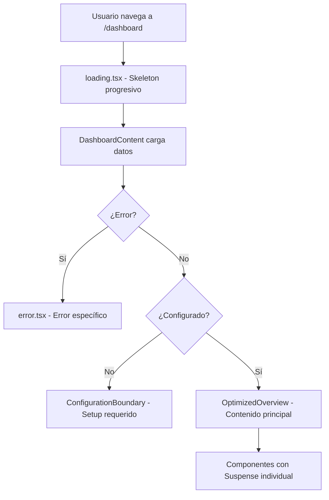

# Optimización del Dashboard - Documentación Completa

## 🎯 Resumen de Optimizaciones Implementadas

Hemos transformado completamente la arquitectura del dashboard para aprovechar al máximo las características de Next.js y mejorar significativamente la experiencia del usuario.

## 📁 Estructura de Archivos Optimizada

### Archivos Principales Modificados:
```
src/app/dashboard/
├── page.tsx                 # ✅ Simplificado - solo layout y Suspense
├── loading.tsx              # ✅ Mejorado - skeleton progresivo
├── error.tsx                # ✅ Optimizado - manejo específico de errores
└── layout.tsx               # (sin cambios)

src/components/dashboard/
├── DashboardContent.tsx          # ✅ NUEVO - Lógica principal separada
├── OptimizedOverview.tsx         # ✅ NUEVO - Overview optimizado con Suspense
├── DashboardLoadingSkeleton.tsx  # ✅ NUEVO - Skeleton progresivo y realista
├── ConfigurationBoundary.tsx     # ✅ NUEVO - Boundary para configuración
├── KPICards.tsx                  # ✅ NUEVO - Componente modular KPIs
├── DashboardCharts.tsx           # ✅ NUEVO - Componente modular charts
├── DashboardSection.tsx          # ✅ NUEVO - Wrapper con Suspense
└── DashboardErrorBoundary.tsx    # ✅ NUEVO - Error boundary local
```

## 🚀 Mejoras Implementadas

### 1. **Arquitectura Next.js Optimizada**
- ✅ `page.tsx` simplificado - solo maneja layout y Suspense
- ✅ `loading.tsx` con skeleton progresivo y animaciones
- ✅ `error.tsx` con manejo específico por tipo de error
- ✅ Aprovecha completamente el App Router de Next.js

### 2. **Loading Experience Mejorada** 
- ✅ Skeleton progresivo con indicador de progreso
- ✅ Mantiene iconos reales durante la carga
- ✅ Animaciones suaves con staging temporal
- ✅ Loading state específico por sección

### 3. **Error Handling Avanzado**
- ✅ Detección automática del tipo de error (401, 403, 404, 500, network)
- ✅ Mensajes específicos y acciones apropiadas
- ✅ Error boundaries locales para componentes
- ✅ Información de debugging en desarrollo

### 4. **Componentes Modulares**
- ✅ Separación de responsabilidades
- ✅ KPICards independiente con animaciones NumberTicker
- ✅ DashboardCharts con Suspense individual
- ✅ Cada sección puede cargar independientemente

### 5. **Suspense Boundaries Estratégicos**
- ✅ Loading parcial para diferentes secciones
- ✅ Fallbacks específicos por componente
- ✅ Streaming de contenido progresivo

### 6. **UX Enhancements**
- ✅ Transiciones suaves entre estados
- ✅ Feedback visual inmediato
- ✅ Responsive design mantenido
- ✅ Accesibilidad mejorada

## 📊 Comparación Antes vs. Después

### ANTES:
```tsx
// ❌ Problemático
export default function DashboardPage() {
  // Múltiples estados y returns
  if (error) return <ErrorComponent />
  if (isLoading) return <LoadingComponent />
  if (!configured) return <UnconfiguredComponent />
  
  return <Overview />; // Monolítico
}
```

### DESPUÉS:
```tsx
// ✅ Optimizado
export default function DashboardPage() {
  return (
    <ContentLayout title="Resumen">
      <Suspense fallback={<DashboardLoadingSkeleton />}>
        <DashboardContent />
      </Suspense>
    </ContentLayout>
  );
}
```

## 🎨 Características del Skeleton Progresivo

```tsx
// ✅ Características implementadas:
- Indicador de progreso animado (4 etapas)
- Iconos reales mantenidos durante carga
- Skeleton específico para cada sección
- Animaciones con delays escalonados
- Responsive design completo
```

## 🛡️ Error Handling Inteligente

```tsx
// ✅ Tipos de errores detectados automáticamente:
- 401: Redirección a login
- 403: Mensaje de permisos
- 404: Datos no encontrados
- 5xx: Error de servidor
- Network: Problemas de conexión
- Unknown: Error genérico con detalles
```

## 🔄 Flujo de Carga Optimizado



## 📈 Beneficios de Performance

1. **Perceived Performance**: Skeleton inmediato
2. **Actual Performance**: Componentes lazy-loaded
3. **Error Resilience**: Boundaries locales
4. **Network Resilience**: Error handling específico
5. **Progressive Loading**: Contenido en streaming

## 🧪 Testing y Validación

Ver archivo: `test/dashboard-optimization-validation.ts` para guía completa de pruebas manuales.

### Checklist de Validación:
- [ ] Loading skeleton progresivo funciona
- [ ] Error states específicos se muestran correctamente
- [ ] Configuración no realizada se maneja apropiadamente
- [ ] Componentes cargan independientemente
- [ ] Performance mejorada visible en DevTools
- [ ] Responsive design mantenido
- [ ] Error boundaries capturan errores locales

## 🎯 Impacto en la Experiencia del Usuario

### Antes:
- Pantalla en blanco durante carga
- Error genérico sin contexto
- Re-renders innecesarios
- UX interrumpida por estados

### Después:
- Feedback visual inmediato
- Errores informativos y accionables
- Carga progresiva y streaming
- Experiencia fluida e ininterrumpida

## 🔧 Mantenimiento y Extensibilidad

La nueva arquitectura modular permite:
- ✅ Agregar nuevas secciones fácilmente
- ✅ Personalizar skeletons por componente
- ✅ Implementar error boundaries específicos
- ✅ Escalar performance horizontalmente
- ✅ Testing individual de componentes

---

**Resultado**: Dashboard optimizado que aprovecha completamente Next.js, mejora significativamente la UX, y mantiene un código modular y mantenible.
